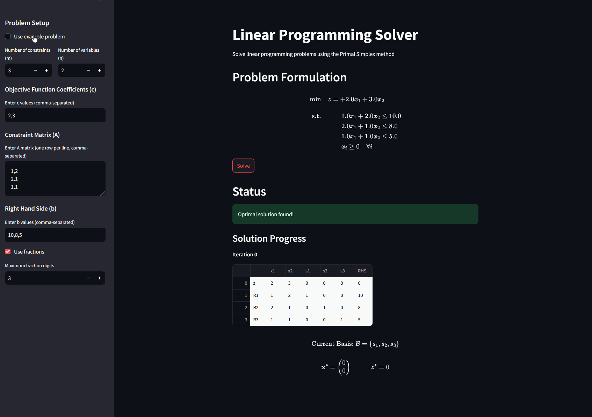

# Linear Programming Solver



A robust implementation of the Primal Simplex method for solving Linear Programming problems. This project includes both a backend solver implementation and a user-friendly web interface built with Streamlit.

## Features

- Implementation of the Two-Phase Primal Simplex algorithm
- Support for both equality and inequality constraints
- Interactive web interface for problem input and visualization
- Step-by-step solution visualization with pivoting information
- Support for both decimal and fraction output formats
- Example problems included for learning and testing
- Comparison with SciPy's linear programming solver
- Detailed tableau visualization at each iteration
- LaTeX formatting for mathematical expressions

## Requirements

Create a conda environment and install the required packages:

```bash
conda create -n lp-solver python=3.9
conda activate lp-solver
pip install -r requirements.txt
```

## Project Structure

```
linear-programming-solver/
├── simplex.py           # Core implementation of the Primal Simplex algorithm
├── frontend_simplex.py  # Streamlit web interface
└── requirements.txt     # Project dependencies
```

## Installation

1. Clone the repository:
```bash
git clone https://github.com/yourusername/linear-programming-solver.git
cd linear-programming-solver
```

2. Create and activate a conda environment:
```bash
conda create -n lp-solver python=3.9
conda activate lp-solver
```

3. Install dependencies:
```bash
pip install -r requirements.txt
```

## Usage

### Running the Web Interface

1. Start the Streamlit application:
```bash
streamlit run frontend_simplex.py
```

2. Open your web browser and navigate to the provided URL (typically http://localhost:8501)

### Using the Command Line Interface

You can also use the solver directly through Python:

```python
import numpy as np
from simplex import PrimalSimplex

# Define your problem
c = np.array([2, 3])  # Objective function coefficients
A = np.array([[1, 2], [2, 1], [1, 1]])  # Constraint coefficients
b = np.array([10, 8, 5])  # Right-hand side values

# Create solver instance
# For inequality constraints (≤)
solver = PrimalSimplex(c, A, b, use_fractions=True, eq_constraints=False)

# Or for equality constraints (=)
solver = PrimalSimplex(c, A, b, use_fractions=True, eq_constraints=True)

# Solve the problem
solution, optimal_value = solver.solve()

print("Optimal solution:", solution)
print("Optimal value:", optimal_value)
```

## Problem Format

The solver handles two types of constraint systems based on the `eq_constraints` parameter:

### Standard Form (eq_constraints=False)
All constraints are treated as less than or equal (≤) constraints. The problem follows the standard form:

$$
\begin{align*}
\text{minimize} \quad & z = \mathbf{c}^\top \mathbf{x} \\
\text{subject to} \quad & \mathbf{A}\mathbf{x} \leq \mathbf{b} \\
& \mathbf{x} \geq \mathbf{0}
\end{align*}
$$

Or more explicitly:

$$
\begin{align*}
\text{minimize} \quad & z = \sum_{j=1}^n c_j x_j \\
\text{subject to} \quad & \sum_{j=1}^n a_{ij}x_j \leq b_i, \quad i = 1,\ldots,m \\
& x_j \geq 0, \quad j = 1,\ldots,n
\end{align*}
$$

### Equality Form (eq_constraints=True)
All constraints are treated as equality (=) constraints, using the two-phase simplex method:

$$
\begin{align*}
\text{minimize} \quad & z = \mathbf{c}^\top \mathbf{x} \\
\text{subject to} \quad & \mathbf{A}\mathbf{x} = \mathbf{b} \\
& \mathbf{x} \geq \mathbf{0}
\end{align*}
$$

Or more explicitly:

$$
\begin{align*}
\text{minimize} \quad & z = \sum_{j=1}^n c_j x_j \\
\text{subject to} \quad & \sum_{j=1}^n a_{ij}x_j = b_i, \quad i = 1,\ldots,m \\
& x_j \geq 0, \quad j = 1,\ldots,n
\end{align*}
$$

Where:
- $$\mathbf{x} \in \mathbb{R}^n$$ is the vector of decision variables
- $$\mathbf{c} \in \mathbb{R}^n$$ is the cost vector
- $$\mathbf{A} \in \mathbb{R}^{m \times n}$$ is the constraint coefficient matrix
- $$\mathbf{b} \in \mathbb{R}^m$$ is the right-hand side vector

Note: When using `eq_constraints=True`, the solver automatically implements the two-phase simplex method to handle the equality constraints, introducing artificial variables as needed.

## License

This project is licensed under the MIT License - see the LICENSE file for details.

## Authors

Nicolas Schneider

## Acknowledgments

- Implementation based on the Two-Phase Simplex Method
- Web interface built using Streamlit
- Mathematical formulations from Linear Programming literature
